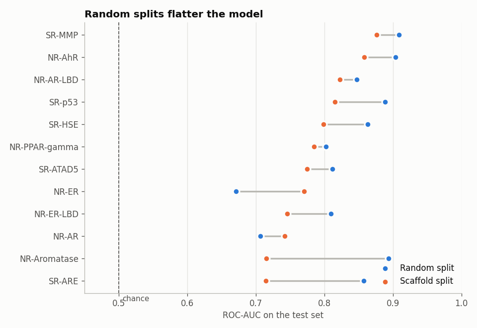
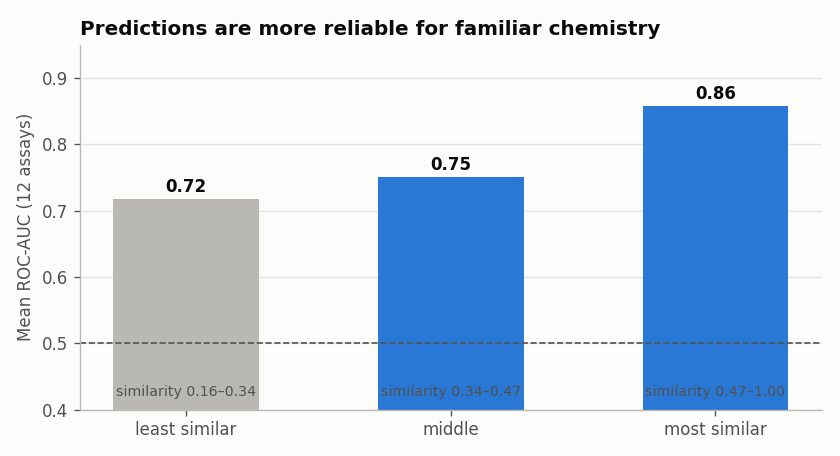

[English](README.md) | **Português**

# Prever a Toxicidade de Químicos a partir da Estrutura Molecular (Tox21)

Conseguimos saber se uma molécula é tóxica só pela sua estrutura? Este projeto constrói e avalia com rigor modelos de machine learning que preveem os resultados de **12 ensaios de toxicidade** para cerca de **7 800 químicos**. Inclui também uma aplicação que traça o perfil de qualquer molécula.

> Os notebooks e o código estão em inglês, para chegar a um público mais alargado.

**Dados:** [Tox21](https://tripod.nih.gov/tox21/challenge/) (EPA, NIH e FDA dos EUA), através do [MoleculeNet](https://moleculenet.org/). Inclui 7 ensaios de recetores nucleares (disrupção hormonal) e 5 de resposta ao stress (danos no ADN, stress oxidativo, danos nas mitocôndrias). Cada resultado é ativo ou inativo. As classes são desequilibradas (3–16% de ativos) e há resultados em falta.

**Resumo em linguagem simples:** [abre o dashboard online](https://ncdomingues.github.io/tox21-toxicity/toxicity-at-a-glance.html) ([código](toxicity-at-a-glance.html)), uma página de síntese para quem não é técnico, em inglês e português.

**Outros projetos:** [Porque param os ensaios clínicos](https://github.com/ncdomingues/clinical-trial-termination) · [Dados da educação em Portugal](https://github.com/ncdomingues/portuguese-education-data)

## Principais resultados
1. **Uma divisão aleatória dos dados dá uma imagem demasiado otimista.** Com uma *divisão por scaffold*, em que as moléculas de teste têm sistemas de anéis que o modelo nunca viu, o ROC-AUC médio é **0,79**, contra **0,83** com uma divisão aleatória. A divisão por scaffold é a estimativa honesta para química nova.

   

2. **Os descritores da molécula inteira são melhores do que as fingerprints** (0,78 contra 0,72). Combinar ambos com um random forest foi o melhor (0,79). O gradient boosting e a regressão logística ficaram atrás.
3. **A confiança depende da semelhança.** O ROC-AUC é **0,86** para moléculas de teste parecidas com as de treino e **0,72** para o terço menos familiar. Cada previsão deve vir acompanhada de um índice de semelhança.

   

4. **O modelo aprende química real.**
   - A atividade no "recetor das dioxinas" (AhR) sobe de 1% para 33% com o número de anéis aromáticos.
   - Os fragmentos mais associados à toxicidade mitocondrial são fenóis lipofílicos como o pentaclorofenol, desacopladores clássicos.
5. **É útil para definir prioridades.** Testar só os 10% de compostos mais bem classificados pelo modelo encontra ativos **4 vezes** mais do que ao acaso e recupera cerca de **40%** de todos os compostos tóxicos.

## Aplicação de perfil de toxicidade
Cola uma SMILES ou escolhe um exemplo, como o bisfenol A, o triclosan ou o benzo[a]pireno. A aplicação mostra:
- a molécula;
- o seu nível de risco previsto em cada um dos 12 ensaios;
- um aviso de fiabilidade, com base na semelhança com os dados de treino;
- a molécula testada mais parecida, com os resultados reais de laboratório.

```bash
streamlit run app/app.py
```

## Estrutura
```
src/featurize.py        descarrega o Tox21; limpa as moléculas; calcula fingerprints de Morgan, descritores RDKit, scaffolds e divisões
src/train_models.py     treina os random forests finais (um por ensaio) usados pela aplicação
src/style.py            estilo comum dos gráficos
notebooks/01_explore_tox21.ipynb      ensaios, desequilíbrio, correlações, relações estrutura–atividade, scaffolds
notebooks/02_predict_toxicity.ipynb   divisão aleatória vs scaffold, comparação de modelos, domínio de aplicabilidade, fragmentos tóxicos, enriquecimento
app/app.py              aplicação Streamlit
figures/                gráficos exportados
toxicity-at-a-glance.html   dashboard em linguagem simples
```

## Como correr
```bash
pip install -r requirements.txt
python src/featurize.py        # ~1 minuto
python src/train_models.py     # alguns minutos, só necessário para a aplicação
jupyter notebook notebooks/
```

## Limitações
- Os resultados de ensaios de alto débito têm ruído, e "inativo" num rastreio não prova que um composto é seguro.
- As características 2D ignoram a forma 3D, que é importante na ligação aos recetores.
- Próximos passos: redes neuronais de grafos, aprendizagem multitarefa entre ensaios relacionados e previsão conformal para dar um grau de confiança a cada molécula.

*Projeto educativo. As previsões não são uma avaliação de segurança.*
